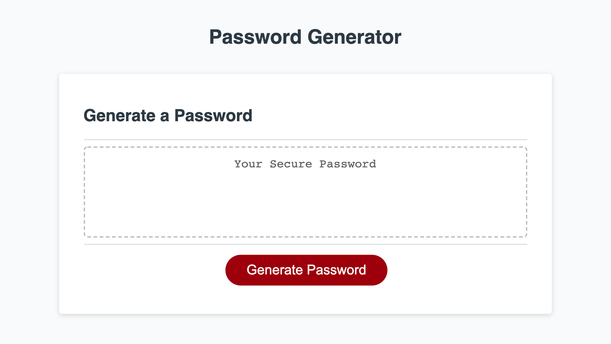

# Password Generator
Using the Password Generator Starter Code, I used javascript to create a working application that allows the user to input how many and what type of characters they would like in their randomly generated password. The user inputs their preferences through a series of window prompt and the final password displays on the page.

## Built with 
* Javascript
* CSS (starter code)
* HTML (starter code)

## Deployed url
https://kesiahp18.github.io/password-generator/

